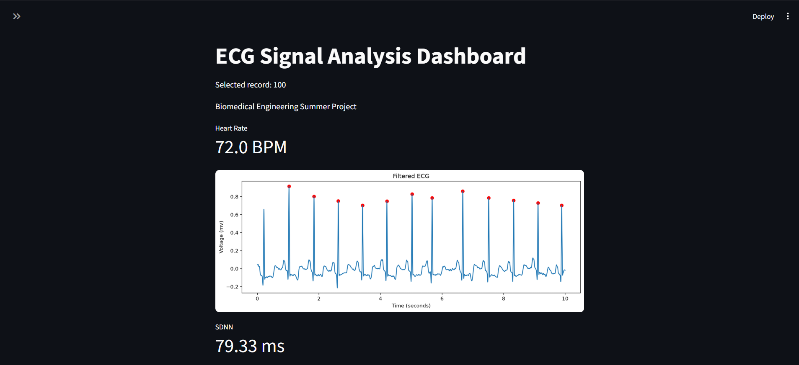
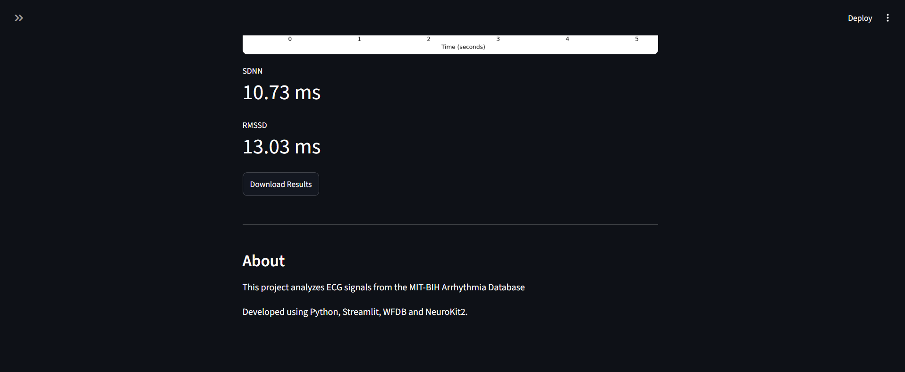
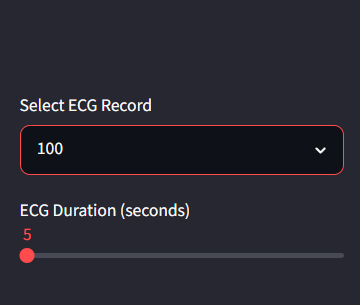
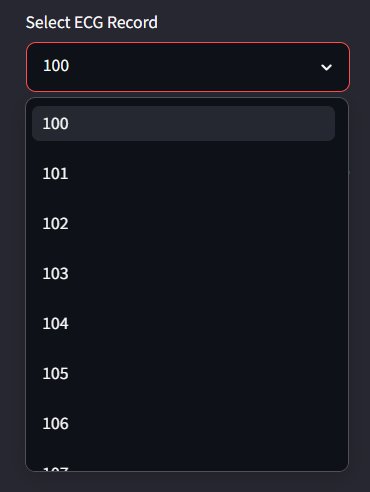
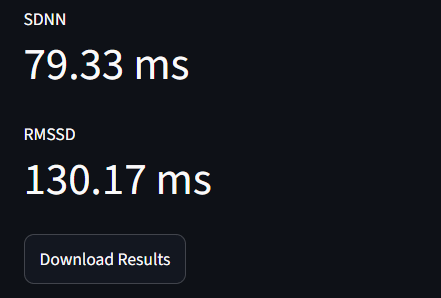
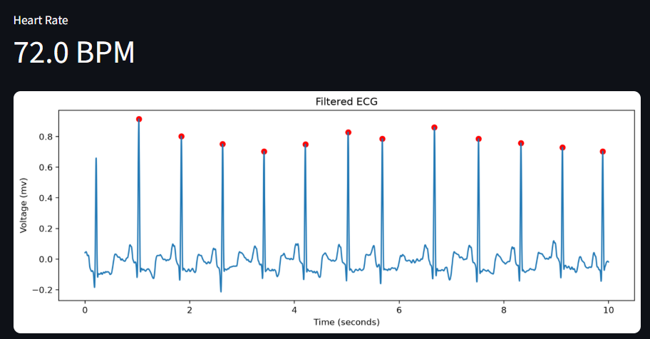

# ECG Signal Analysis Dashboard

## Overview

This project analyzes ECG signals from the MIT-BIH Arrhythmia Database using Python.

The application filters ECG signals, detects R-Peaks, calculates heart rate and heart rate variability (HRV), and displays the results through an interactive Streamlit dashboard.

## Features

- Load ECG recordings
- Filter ECG Signals
- Detect R-Peaks
- Calculate HRV (SDNN & RMSSD)
- Export Results as CSV
- Interactive Streamlit Dashboard

## Technologies

- Python
- Streamlit
- NeuroKit2
- WFDB
- Matplotlib
- Pandas

## Dataset

MIT-BIH Arrythmia Database

## Installation

Clone the repository:

```Python
git clone <repository-url>
```

Create a virtual environment:

```Python
-m venv venv
```

Activate it.

Installed the required libraries:

```Python
pip install -r requirements.txt
```

## How to Run

```Python
streamlit run src/app2.py
```

## Dashboard Preview





### Sidebar





### Metrics



## ECG Plot


